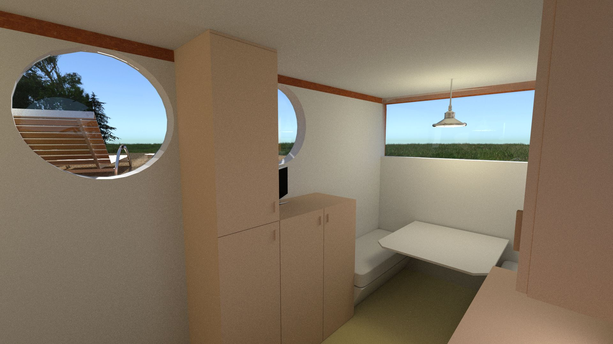

Jaar Salo
=========

Een nieuw concept in duurzaam wonen en natuurbeleving. Project Jaar Salo stelt als doel om zelfvoorzienend te kunnen wonen in harmonie met de omgeving. 

De volgende principes worden gehanteerd voor de realisatie:

* off grid - volledig zelfstandig en los van bestaande netwerken
* [open source](https://github.com/sphaero/stardust) - alle toegepaste kennis en techniek is openbaar
* sustainable - duurzaam zowel in fabricage als gebruik 
* modulair - basisunit met diverse uitbreidingsmogelijkheden
* unieke beleving van de omgeving

