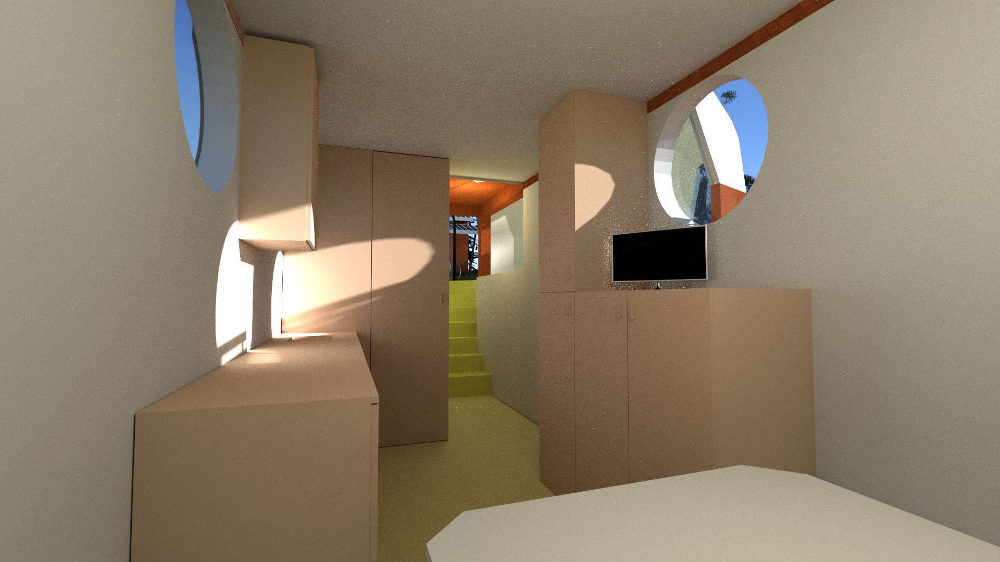

...!!!
======

Jaar Salo speelt in op een groeiende behoefte in de maatschappij naar duurzaamheid. Binnen deze behoefte geven wij zelfvoorziening en de beleving van de directe omgeving een significante rol. Zelfvoorzienend wonen levert onafhankelijkheid en vrijheid op. Wij ontwerpen een off-grid woning, uitgerust met alle moderne gemakken. De woning, met deze uitgangspunten, is het middelpunt van het Jaar Salo project. De start van een breder concept. 

Het zelf voorzien in basisbenodigdheden brengt een nieuwe bewustwording op gang. Een zelfvoorzienende woning heeft een aantal praktische bijkomstigheden. Sommige daarvan zijn eenvoudiger op te lossen in collectiviteit en verbondenheid. Bijvoorbeeld de opslag van energie of het reinigen van water. Het Jaar Salo concept houdt rekening met zowel individuele behoeften als voordelen van gemeenschappelijkheid. We maken daarom gebruik van modulaire oplossingen die te koppelen zijn. Hiermee biedt Jaar Salo de mogelijkheid tot decentralisatie en de ontwikkeling van kleinschalige gemeenschappen.

De Jaar Salo off-grid woning bestaat globaal uit twee onderdelen: een zeecontainer die voor 3/5 deel ondergronds wordt geplaatst en gekoppeld is aan een bovengronds deel. Door de ondergrondse plaatsing van de container ervaart men de omgeving op maaiveldhoogte. Dit deel is de 'motor' van het huis en herbergt tevens de 'huishoudelijke functies' slapen, koken, eten en sanitair. Een aan de container gekoppeld trapportaal verbindt de onder- en bovenwereld. Het bovengrondse deel is in beeldende zin bepalend voor het geheel. Het functioneert als verblijfsruimte met de blik zowel naar de hemel als 360 graden rondom. Dit bovengrondse deel bepaalt het unieke karakter van de unit. Afhankelijk van de locatie en situatie zijn verschillende varianten in te zetten. De gepresenteerde combinatie van het ondergrondse en bovengrondse deel wekt de associatie met een ‘individuele’ energie centrale. 

Gebruikte oplossingen voor energie, water en afval
--------------------------------------------------

Afhankelijk van de locatie specifieke mogelijkheden zal gebruikt worden gemaakt van een op maat samengestelde combinatie van middelen. Dit is natuurlijk afhankelijk van nieuwe ontwikkelingen maar momenteel maken we gebruik van:

* Energie: alles 12 volt.
    * zonnepanelen, 
    * biogas, 
    * lithium accu's, 
    * elektrische auto, 
    * fysiek,
* water: 
    * regenwater (daken en terras), 
    * ecotoilet, 
    * waterscheiding, 
    * helofytenfilter, 
    * waterput.
* warmte: 
    * pelletkachel, 
    * warmtepomp-warmwatervat, 
    * micro-warmtekrachtkoppeling

Extra zonnepanelen worden, indien nodig, geplaatst op een externe overkapping. Daarbij is de unit zodanig ontworpen dat het mogelijkheden biedt tot kleinschalige collectiviteit in de vorm van opslag en uitwisseling.

Het totale vloeroppervlak van ondergronds en bovengronds deel samen bedraagt: 27m2 (van de afgebeelde unit, grotere variaties zijn mogelijk)
